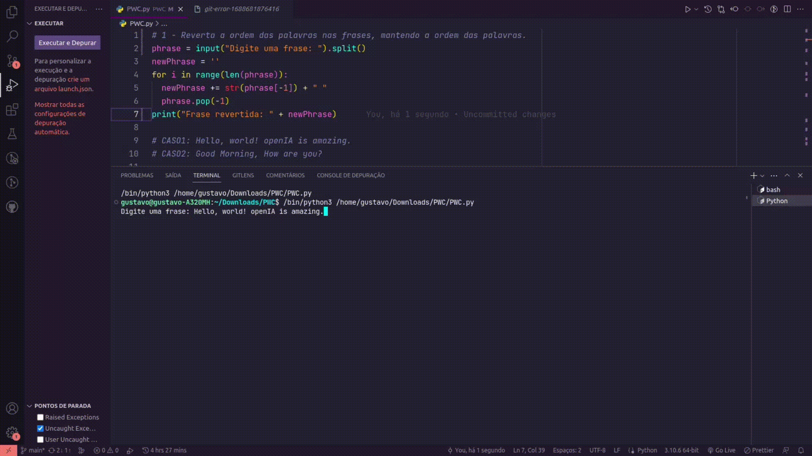

# PWC
Desafio de Código, avaliação para o processo seletivo da PWC

## Desafio 1
Reverta a ordem das palavras nas frases, mantendo a ordem das palavras:

> Neste desafio utilizei um laço para reestruturar a string.

## Desafio 2
Remova todos os caracteres duplicados da string abaixo:

> No segundo desafio usei uma validação de negação para remover caracteres repetidos.

## Desafio 3
Encontre a substring palíndroma mais longa na string abaixo:

> No terceiro desafio, aprendi um conceito novo de fatiamento, usando : para retornar todo o valor de uma string/list até certo índice, depois uma validação para verficar se as strings seriam iguais.

## Desafio 4
Coloque em maiúscula a primera letra de cada frase na string:

> No quarto desafio, eu uni os conceitos dos desafios anteriores, validando os sinais que indicam o fim da frase e também palavras que necessitam estar em maiúsculo, concatenando tudo em uma nova string.

## Desafio 5
Verifique se a string é um anagrama de um palíndromo:

> No quinto desafio, neste último desafio, repensei a lógica do 3 aplicando agora apenas um laço, para retornar uma string com a ordem contrária da primeira string, por fim validando se essa nova string seria igual a primeira.

